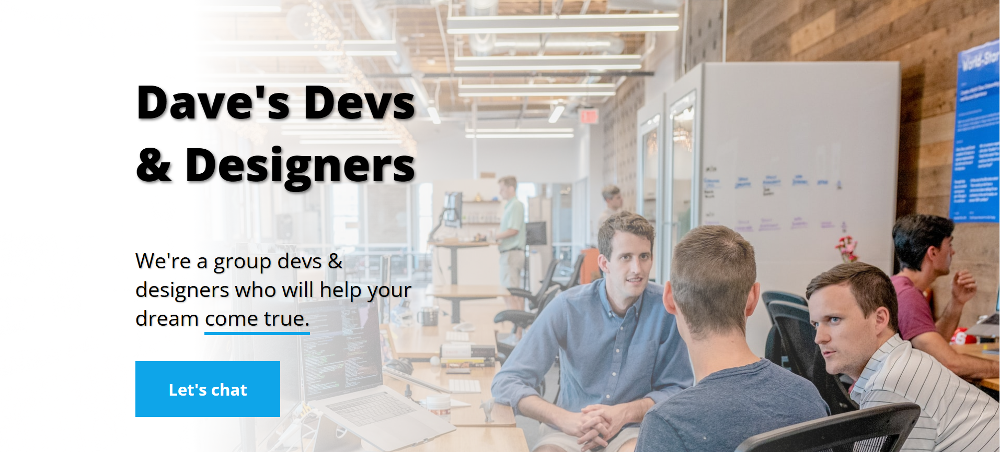

# 🚀 Dave's Devs & Designers - Web Agency Hero Page

A modern, responsive hero page for "Dave's Devs & Designers" web agency built with HTML, CSS, and Vite. This project features a stunning hero section with interactive elements and smooth animations.



## ✨ Features

- **Modern Hero Design**: Clean, professional layout with compelling call-to-action
- **Interactive Elements**: Hover effects on button and highlighted text
- **Responsive Design**: Flexbox-based layout that works on all devices
- **Smooth Animations**: CSS transitions and transforms for enhanced user experience
- **Professional Typography**: Open Sans font family for modern readability
- **Background Image**: Blurred office environment creating depth and context
- **Text Shadow Effects**: Enhanced readability against background image

## 🎨 Design Features

- **Hero Section**: Centered content with left-aligned text for better readability
- **Interactive Button**: "Let's chat" button with hover effects (lift and color change)
- **Highlighted Text**: "come true" text with blue underline and hover animation
- **Background**: Professional office environment with blur effect
- **Typography**: Bold, modern font hierarchy with proper spacing
- **Color Scheme**: Blue accent color (#0ea5e9) with clean white text

## 🛠️ Technologies Used

- **HTML5**: Semantic markup structure
- **CSS3**: Modern styling with flexbox, transforms, and animations
- **Vite**: Fast build tool and development server
- **Google Fonts**: Open Sans font family
- **Responsive Design**: Mobile-first approach

## 📁 Project Structure

```
web-agency/
├── img/
│   ├── faded-office.png    # Background office image
│   └── image.png           # Project preview image
├── index.html              # Main HTML file
├── styles.css              # CSS styling and animations
├── package.json            # Project dependencies
├── vite.config.js          # Vite configuration
└── README.md               # Project documentation
```

## 🎯 Key CSS Techniques Demonstrated

- **Flexbox Layout**: `display: flex` with `justify-content` and `align-items`
- **CSS Transforms**: `translateY()` and `scale()` for hover effects
- **CSS Transitions**: Smooth animations with `transition` property
- **Text Shadow**: Enhanced readability with `text-shadow`
- **Background Images**: `background-image` with `background-size: cover`
- **Display Properties**: `inline-block` for transformable inline elements
- **Hover Effects**: Interactive button and text animations

## 🚀 Getting Started

### Prerequisites

- Node.js (version 14 or higher)
- npm or yarn package manager

### Installation

1. **Clone the repository**

   ```bash
   git clone <your-repo-url>
   cd web-agency
   ```

2. **Install dependencies**

   ```bash
   npm install
   ```

3. **Start development server**

   ```bash
   npm run dev
   ```

4. **Open in browser**
   Navigate to `http://localhost:5173` to view your hero page

### Build for Production

```bash
npm run build
```

### Preview Production Build

```bash
npm run preview
```

## 🎨 Customization

### Content Updates

Edit `index.html` to update:

- Company name and tagline
- Call-to-action button text
- Hero message content

### Styling

Modify `styles.css` to customize:

- Colors and typography
- Hover effects and animations
- Layout spacing and positioning
- Background image

### Color Palette

The current design uses:

- Primary Blue: `#0ea5e9` (Button and underline)
- Hover Blue: `#0284c7` (Darker blue for hover states)
- Text: White with black shadows
- Background: Blurred office image

## 🌟 Interactive Features

- **Button Hover**: Lifts up and changes color on hover
- **Text Highlight**: "come true" text animates on hover
- **Smooth Transitions**: All animations use CSS transitions
- **Responsive Layout**: Adapts to different screen sizes

## 📱 Responsive Design

The hero page is designed to work seamlessly across all device sizes:

- **Desktop**: Full viewport height with optimal spacing
- **Tablet**: Responsive layout for medium screens
- **Mobile**: Optimized for small screens

## 🔧 Development

This project uses Vite for fast development and building:

- **Hot Module Replacement**: Instant updates during development
- **Fast Build**: Optimized production builds
- **Modern Tooling**: Latest web development standards

## 📄 License

This project is open source and available under the [MIT License](LICENSE).

## 🤝 Contributing

Contributions are welcome! Please feel free to submit a Pull Request.

## 📚 Project Origin

This project was created as part of the **Pro Developer Path** on [Scrimba.com](https://scrimba.com/). It demonstrates modern CSS techniques including flexbox, transforms, transitions, and responsive design principles.

**Course**: [Learn HTML & CSS](https://scrimba.com/learn-html-and-css-c0p)
**Platform**: [Scrimba.com](https://scrimba.com/) - Interactive coding tutorials

## 📞 Contact

- **Developer**: Ali Hassan
- **Email**: [m.alihassan002@gmail.com](mailto:m.alihassan002@gmail.com)
- **LinkedIn**: [Ali Hassan](https://www.linkedin.com/in/ali-hassan-9ba69220b/)
- **Location**: Lahore, Pakistan
- **Role**: Full Stack Developer

---

_Built with ❤️ using modern web technologies and CSS animations_
